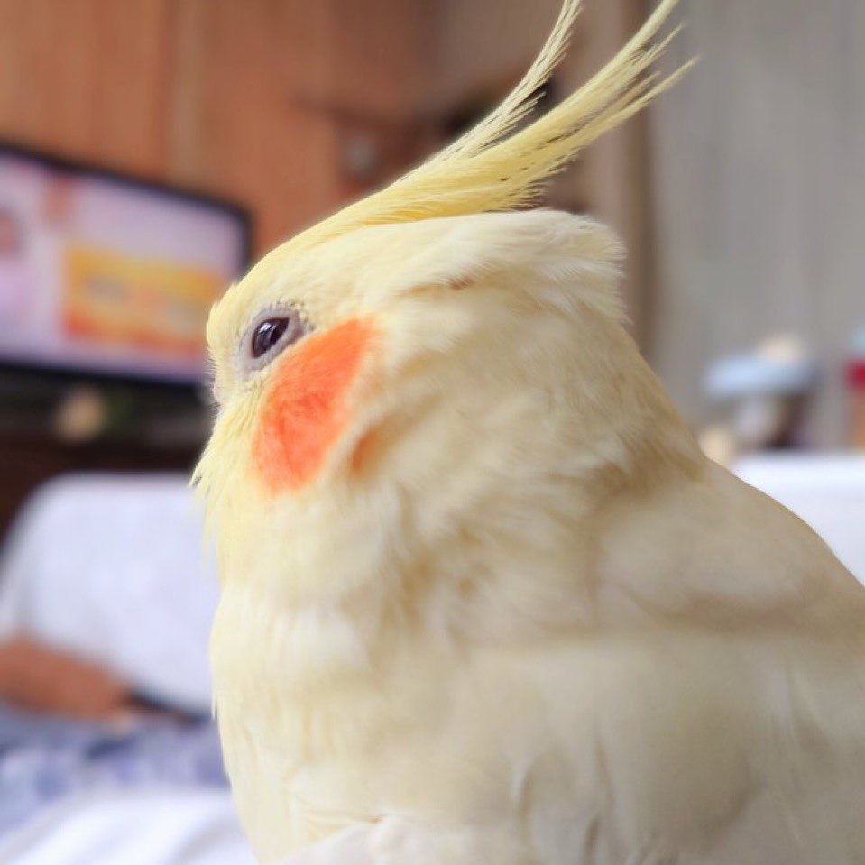

## Moth Loftus

### Summary

My goal is to gain experience through a company that values growth and ambition that will serve my education as a college student. I'm a senior at Appalachian State University studying biology and geography. 

### Education 
* Pitt County Schools Early College High School (High School Diploma - 4.6)

* Pitt Community College (Associates in Science - 4.0)

* [Appalachian State University](https://www.appstate.edu/), Boone Bachelor’s of Science Degree in Biology with a concentration in Ecology, Evolution, and Environmental Biology (3.71, Projected Graduation in May 2025)

### Work Experience/Relevant Research
1. Held Jobs
    - High School Civics and Economics Tutor and Teaching Assistant (2017-2021)
    - LEAD Tutor for Introductory Chemistry and Organic Chemistry (2023-Present)
2. Relevant Research
    - Dr. Jenny Geib Bee & Pollinator Lab (2021-Present)
        * Worked closely with graduate students and capstone-taking seniors to analyze bee and other pollinator behavior and fecundity.

(image upload:)

